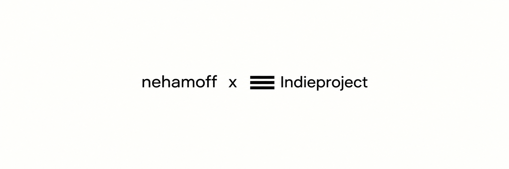

  

<h1 align="center">🌍 GeoIP и Geosite для Xray — маршрутизация VPN и RU-сайты напрямую</h1>

  <strong>Готовое раздельное туннелирование VPN для Xray-core, V2Ray, Happ, Incy и Remnawave</strong>

  
  
  

  

**IndieVPN-GEO** — готовые файлы **geosite.dat** и **geoip.dat** для
маршрутизации ВПН (VPN) и раздельного туннелирования (split tunneling). База
помогает сделать российские сайты и приложения напрямую, мимо VPN, а
YouTube, Telegram, Discord, AI-сервисы и заблокированные ресурсы отправить
через VPN. Поддерживаются Xray-core, V2Ray, Happ, Incy, Remnawave и другие
совместимые клиенты.

Проект подойдёт, если вы искали:

- как настроить маршрутизацию VPN;
- как сделать RU-сайты мимо VPN;
- как настроить раздельное туннелирование VPN на Windows, Android или iPhone;
- где скачать **geosite.dat RU** и **geoip.dat Russia** для Xray/V2Ray;
- как добавить маршрутизацию в Happ или Incy;
- как раздавать GEO-файлы через подписку Remnawave.

  <a href="https://github.com/nehamoff/IndieVPN-GEO/raw/refs/heads/main/geosite.dat"><strong>⬇️ Скачать geosite.dat</strong></a>
  &nbsp;•&nbsp;
  <a href="https://github.com/nehamoff/IndieVPN-GEO/raw/refs/heads/main/geoip.dat"><strong>⬇️ Скачать geoip.dat</strong></a>
  &nbsp;•&nbsp;
  <a href="https://t.me/IndieVpnRobot?start=ref_githubgeo"><strong>🚀 Попробовать IndieVPN</strong></a>

---

## 📦 Что внутри

| Файл | Категорий | Записей | Уникальных |
|---|---:|---:|---:|
| **geosite.dat** | 36 | 29 147 доменных правил | 27 642 |
| **geoip.dat** | 5 | 51 376 CIDR-подсетей | 26 263 |

Все записи Geosite имеют тип **domain**: совпадает сам домен и любой его
поддомен. Правил **full**, **regexp**, **plain** и атрибутов в файле нет.
GeoIP-инверсия нигде не используется.

Полные списки:

- [все домены](./geosite-all-rules.csv);
- [все IP-подсети](./geoip-all-cidrs.csv);
- [сводка Geosite](./geosite-categories.csv);
- [сводка GeoIP](./geoip-categories.csv);
- [статистика JSON](./summary.json).

## 📲 Готовое подключение для Happ и Incy

Мы подготовили профиль **IndieVPN Smart RU**, который:

- скачивает обе geodata-базы напрямую из этого GitHub-репозитория;
- отправляет российские домены и IP напрямую;
- отправляет заблокированные ресурсы, Telegram, YouTube, Discord, AI и
  другие выбранные сервисы через VPN;
- блокирует категорию рекламы;
- содержит только правила маршрутизации и ссылки на GEO-файлы.

Готовые файлы:

| Файл | Для чего |
|---|---|
| [profiles/indievpn-smart-ru.json](./profiles/indievpn-smart-ru.json) | общий профиль маршрутизации Happ/Incy |
| [headers/happ-routing-header.txt](./headers/happ-routing-header.txt) | готовый HTTP-заголовок для Happ |
| [headers/incy-autorouting-header.txt](./headers/incy-autorouting-header.txt) | готовый автообновляемый заголовок Incy |
| [headers/remnawave-response-headers.json](./headers/remnawave-response-headers.json) | оба заголовка одним JSON для Remnawave |

### Прямые GitHub Raw-ссылки

~~~text
GeoIP:
https://raw.githubusercontent.com/nehamoff/IndieVPN-GEO/main/geoip.dat

Geosite:
https://raw.githubusercontent.com/nehamoff/IndieVPN-GEO/main/geosite.dat

Профиль маршрутизации:
https://raw.githubusercontent.com/nehamoff/IndieVPN-GEO/main/profiles/indievpn-smart-ru.json
~~~

### Заголовок Happ — скопировать целиком

Happ принимает JSON-профиль в Base64 через заголовок **routing**. Команда
**onadd** добавляет профиль и сразу делает его активным.

~~~text
routing: happ://routing/onadd/eyJOYW1lIjoiSW5kaWVWUE4gU21hcnQgUlUiLCJHbG9iYWxQcm94eSI6InRydWUiLCJ1c2VDaHVua0ZpbGVzIjpmYWxzZSwiTGFzdFVwZGF0ZWQiOiIxNzkwNDM5NjY0IiwiUm91dGVPcmRlciI6ImJsb2NrLXByb3h5LWRpcmVjdCIsIkRpcmVjdFNpdGVzIjpbImdlb3NpdGU6cHJpdmF0ZSIsImdlb3NpdGU6cnUtY29yZSIsImdlb3NpdGU6Y2F0ZWdvcnktcnUiXSwiRGlyZWN0SXAiOlsiZ2VvaXA6cHJpdmF0ZSIsImdlb2lwOnJ1Il0sIlByb3h5U2l0ZXMiOlsiZ2Vvc2l0ZTp0ZWxlZ3JhbSIsImdlb3NpdGU6Z2l0aHViIiwiZ2Vvc2l0ZTpkaXNjb3JkIiwiZ2Vvc2l0ZTp3aGF0c2FwcCIsImdlb3NpdGU6YmFubmVkLXJ1IiwiZ2Vvc2l0ZTpob3N0aW5nIiwiZ2Vvc2l0ZTp5b3V0dWJlIiwiZ2Vvc2l0ZTphaSIsImdlb3NpdGU6Y3J5cHRvIiwiZ2Vvc2l0ZTp0d2l0Y2giLCJnZW9zaXRlOnBpbnRlcmVzdCIsImdlb3NpdGU6Z29vZ2xlLXBsYXkiLCJnZW9zaXRlOmNhdGVnb3J5LWdlb2Jsb2NrLXJ1Il0sIlByb3h5SXAiOlsiZ2VvaXA6dGVsZWdyYW0iLCJnZW9pcDpibG9ja2VkLXJ1Il0sIkJsb2NrU2l0ZXMiOlsiZ2Vvc2l0ZTpjYXRlZ29yeS1hZHMiXSwiQmxvY2tJcCI6W10sIkRvbWFpblN0cmF0ZWd5IjoiSVBJZk5vbk1hdGNoIiwiR2VvaXB1cmwiOiJodHRwczovL3Jhdy5naXRodWJ1c2VyY29udGVudC5jb20vbmVoYW1vZmYvSW5kaWVWUE4tR0VPL21haW4vZ2VvaXAuZGF0IiwiR2Vvc2l0ZXVybCI6Imh0dHBzOi8vcmF3LmdpdGh1YnVzZXJjb250ZW50LmNvbS9uZWhhbW9mZi9JbmRpZVZQTi1HRU8vbWFpbi9nZW9zaXRlLmRhdCJ9
~~~

Готовая строка также лежит в
[headers/happ-routing-header.txt](./headers/happ-routing-header.txt).

> Happ обновляет профиль при повторном получении профиля с тем же **Name**.
> Поле **LastUpdated** должно быть новее предыдущего. Сами DAT-файлы
> скачиваются по **Geoipurl** и **Geositeurl** в фоне.

### Заголовок Incy — скопировать целиком

Для Incy используется **autorouting**, поэтому клиент привязывается к
удалённому JSON и самостоятельно проверяет его обновления.

~~~text
autorouting: incy://autorouting/onadd/https://raw.githubusercontent.com/nehamoff/IndieVPN-GEO/main/profiles/indievpn-smart-ru.json
~~~

Готовая строка также лежит в
[headers/incy-autorouting-header.txt](./headers/incy-autorouting-header.txt).

> Нельзя передавать в заголовке autorouting один голый URL. Обязателен
> префикс **incy://autorouting/onadd/**. Incy по умолчанию обновляет такой
> профиль раз в 24 часа; интервал можно изменить внутри приложения.

### Ручной импорт без подписки

- Happ: скопируйте значение из
  [happ-routing-header.txt](./headers/happ-routing-header.txt) без части
  **routing:** и откройте полученный deeplink.
- Incy: откройте эту ссылку:

~~~text
incy://autorouting/onadd/https://raw.githubusercontent.com/nehamoff/IndieVPN-GEO/main/profiles/indievpn-smart-ru.json
~~~

## 🌊 Встройка в Remnawave

### Способ A — глобальные Response Headers

Самый простой способ: заголовки будут приходить вместе с каждой подпиской, а
клиент возьмёт только тот формат, который понимает.

1. Откройте панель Remnawave.
2. Перейдите в **Subscription → Settings → Response Headers**. В разных
   версиях раздел может называться **Custom Response Headers** или
   **Кастомные хедеры**.
3. Не удаляя свои существующие заголовки, добавьте два новых ключа:

~~~json
{
  "routing": "happ://routing/onadd/eyJOYW1lIjoiSW5kaWVWUE4gU21hcnQgUlUiLCJHbG9iYWxQcm94eSI6InRydWUiLCJ1c2VDaHVua0ZpbGVzIjpmYWxzZSwiTGFzdFVwZGF0ZWQiOiIxNzkwNDM5NjY0IiwiUm91dGVPcmRlciI6ImJsb2NrLXByb3h5LWRpcmVjdCIsIkRpcmVjdFNpdGVzIjpbImdlb3NpdGU6cHJpdmF0ZSIsImdlb3NpdGU6cnUtY29yZSIsImdlb3NpdGU6Y2F0ZWdvcnktcnUiXSwiRGlyZWN0SXAiOlsiZ2VvaXA6cHJpdmF0ZSIsImdlb2lwOnJ1Il0sIlByb3h5U2l0ZXMiOlsiZ2Vvc2l0ZTp0ZWxlZ3JhbSIsImdlb3NpdGU6Z2l0aHViIiwiZ2Vvc2l0ZTpkaXNjb3JkIiwiZ2Vvc2l0ZTp3aGF0c2FwcCIsImdlb3NpdGU6YmFubmVkLXJ1IiwiZ2Vvc2l0ZTpob3N0aW5nIiwiZ2Vvc2l0ZTp5b3V0dWJlIiwiZ2Vvc2l0ZTphaSIsImdlb3NpdGU6Y3J5cHRvIiwiZ2Vvc2l0ZTp0d2l0Y2giLCJnZW9zaXRlOnBpbnRlcmVzdCIsImdlb3NpdGU6Z29vZ2xlLXBsYXkiLCJnZW9zaXRlOmNhdGVnb3J5LWdlb2Jsb2NrLXJ1Il0sIlByb3h5SXAiOlsiZ2VvaXA6dGVsZWdyYW0iLCJnZW9pcDpibG9ja2VkLXJ1Il0sIkJsb2NrU2l0ZXMiOlsiZ2Vvc2l0ZTpjYXRlZ29yeS1hZHMiXSwiQmxvY2tJcCI6W10sIkRvbWFpblN0cmF0ZWd5IjoiSVBJZk5vbk1hdGNoIiwiR2VvaXB1cmwiOiJodHRwczovL3Jhdy5naXRodWJ1c2VyY29udGVudC5jb20vbmVoYW1vZmYvSW5kaWVWUE4tR0VPL21haW4vZ2VvaXAuZGF0IiwiR2Vvc2l0ZXVybCI6Imh0dHBzOi8vcmF3LmdpdGh1YnVzZXJjb250ZW50LmNvbS9uZWhhbW9mZi9JbmRpZVZQTi1HRU8vbWFpbi9nZW9zaXRlLmRhdCJ9",
  "autorouting": "incy://autorouting/onadd/https://raw.githubusercontent.com/nehamoff/IndieVPN-GEO/main/profiles/indievpn-smart-ru.json"
}
~~~

Можно целиком скопировать
[готовый JSON](./headers/remnawave-response-headers.json).

4. Сохраните настройки.
5. В Happ/Incy обновите подписку либо удалите и добавьте её заново.

> Если в редакторе уже есть **profile-title**, **announce**, **support-url**
> и другие ключи, добавьте **routing** и **autorouting** в существующий
> объект. Не заменяйте весь объект двумя строками из примера.

### Способ B — отдельные Subscription Response Rules

Этот вариант отправляет каждый заголовок только нужному приложению.

1. Откройте **Subscription → Response Rules**.
2. В существующем правиле Happ добавьте в
   **responseModifications.headers**:

~~~json
{
  "key": "routing",
  "value": "happ://routing/onadd/eyJOYW1lIjoiSW5kaWVWUE4gU21hcnQgUlUiLCJHbG9iYWxQcm94eSI6InRydWUiLCJ1c2VDaHVua0ZpbGVzIjpmYWxzZSwiTGFzdFVwZGF0ZWQiOiIxNzkwNDM5NjY0IiwiUm91dGVPcmRlciI6ImJsb2NrLXByb3h5LWRpcmVjdCIsIkRpcmVjdFNpdGVzIjpbImdlb3NpdGU6cHJpdmF0ZSIsImdlb3NpdGU6cnUtY29yZSIsImdlb3NpdGU6Y2F0ZWdvcnktcnUiXSwiRGlyZWN0SXAiOlsiZ2VvaXA6cHJpdmF0ZSIsImdlb2lwOnJ1Il0sIlByb3h5U2l0ZXMiOlsiZ2Vvc2l0ZTp0ZWxlZ3JhbSIsImdlb3NpdGU6Z2l0aHViIiwiZ2Vvc2l0ZTpkaXNjb3JkIiwiZ2Vvc2l0ZTp3aGF0c2FwcCIsImdlb3NpdGU6YmFubmVkLXJ1IiwiZ2Vvc2l0ZTpob3N0aW5nIiwiZ2Vvc2l0ZTp5b3V0dWJlIiwiZ2Vvc2l0ZTphaSIsImdlb3NpdGU6Y3J5cHRvIiwiZ2Vvc2l0ZTp0d2l0Y2giLCJnZW9zaXRlOnBpbnRlcmVzdCIsImdlb3NpdGU6Z29vZ2xlLXBsYXkiLCJnZW9zaXRlOmNhdGVnb3J5LWdlb2Jsb2NrLXJ1Il0sIlByb3h5SXAiOlsiZ2VvaXA6dGVsZWdyYW0iLCJnZW9pcDpibG9ja2VkLXJ1Il0sIkJsb2NrU2l0ZXMiOlsiZ2Vvc2l0ZTpjYXRlZ29yeS1hZHMiXSwiQmxvY2tJcCI6W10sIkRvbWFpblN0cmF0ZWd5IjoiSVBJZk5vbk1hdGNoIiwiR2VvaXB1cmwiOiJodHRwczovL3Jhdy5naXRodWJ1c2VyY29udGVudC5jb20vbmVoYW1vZmYvSW5kaWVWUE4tR0VPL21haW4vZ2VvaXAuZGF0IiwiR2Vvc2l0ZXVybCI6Imh0dHBzOi8vcmF3LmdpdGh1YnVzZXJjb250ZW50LmNvbS9uZWhhbW9mZi9JbmRpZVZQTi1HRU8vbWFpbi9nZW9zaXRlLmRhdCJ9"
}
~~~

3. Создайте или откройте правило Incy с условием:

~~~json
{
  "caseSensitive": false,
  "headerName": "user-agent",
  "operator": "CONTAINS",
  "value": "incy"
}
~~~

4. В **responseModifications.headers** этого правила добавьте:

~~~json
{
  "key": "autorouting",
  "value": "incy://autorouting/onadd/https://raw.githubusercontent.com/nehamoff/IndieVPN-GEO/main/profiles/indievpn-smart-ru.json"
}
~~~

5. Установите **applyHeadersToEnd: true**, если другие правила или External
   Squads могут перезаписывать заголовки.

> Response Rules проверяются сверху вниз и останавливаются на первом
> совпадении. Поместите правила Happ/Incy выше общего fallback-правила.
> Значение **responseType** и шаблон подписки выбирайте под свою существующую
> конфигурацию — добавление routing-заголовков не требует менять формат
> выдаваемых серверов.

### Проверка заголовков подписки

Замените адрес на свою публичную ссылку подписки:

~~~bash
curl -sS -A "Happ/1.0" -D - -o /dev/null \
  "https://sub.example.com/SHORT_UUID" \
  | grep -iE "^(routing|autorouting):"
~~~

В ответе должны присутствовать обе строки:

~~~text
routing: happ://routing/onadd/...
autorouting: incy://autorouting/onadd/https://raw.githubusercontent.com/...
~~~

Проверьте и прямую доступность файлов:

~~~bash
curl -fIL https://raw.githubusercontent.com/nehamoff/IndieVPN-GEO/main/geoip.dat
curl -fIL https://raw.githubusercontent.com/nehamoff/IndieVPN-GEO/main/geosite.dat
curl -fL https://raw.githubusercontent.com/nehamoff/IndieVPN-GEO/main/profiles/indievpn-smart-ru.json
~~~

### Как проходит обновление

~~~text
Remnawave subscription
├── routing → Happ получает Base64-профиль
│   └── Geoipurl / Geositeurl → скачивание DAT с GitHub
└── autorouting → Incy получает URL профиля на GitHub
    └── профиль → Geoipurl / Geositeurl → скачивание DAT с GitHub
~~~

При обновлении баз замените DAT-файлы в репозитории. Для Happ также обновите
**LastUpdated** в JSON и пересоберите Base64-заголовок. Incy сам заберёт новую
версию JSON по расписанию.

## ⚡ Быстрая установка

Положите оба DAT-файла рядом с Xray или в каталог ресурсов:

- **/usr/local/share/xray/**;
- **/usr/share/xray/**;
- каталог из переменной **XRAY_LOCATION_ASSET**.

Стандартные имена используются так:

~~~json
{
  "domain": ["geosite:YOUTUBE"],
  "ip": ["geoip:TELEGRAM"]
}
~~~

Если системные базы заменять нельзя, переименуйте эти файлы, например в
**indie-geosite.dat** и **indie-geoip.dat**, и используйте внешний синтаксис:

~~~json
{
  "domain": ["ext:indie-geosite.dat:YOUTUBE"],
  "ip": ["ext:indie-geoip.dat:TELEGRAM"]
}
~~~

Внешние файлы тоже должны лежать в каталоге ресурсов Xray.

## 🧠 Как работает маршрутизация Xray

Xray читает **routing.rules** сверху вниз и останавливается на первом
совпадении. Поэтому исключения всегда ставятся раньше широких списков.

- Элементы одного массива работают как **ИЛИ**.
- Разные поля одного правила работают как **И**.
- **domain** проверяет доменное имя.
- **ip** проверяет IP назначения.
- **outboundTag** выбирает конкретный выход.
- **balancerTag** выбирает настроенный балансировщик.
- Если ничего не совпало, Xray использует первый outbound конфигурации.

Пример: только TCP-трафик YouTube через VPN:

~~~json
{
  "type": "field",
  "network": "tcp",
  "domain": ["geosite:YOUTUBE"],
  "outboundTag": "proxy"
}
~~~

В примерах используются следующие теги:

- **proxy** — основной VPN-outbound;
- **direct** — прямое подключение;
- **block** — сброс соединения;
- **proxy-us**, **proxy-eu**, **proxy-game** — дополнительные VPN-выходы.

Добавьте к своим outbounds прямой и блокирующий выходы:

~~~json
{
  "outbounds": [
    {
      "tag": "direct",
      "protocol": "freedom",
      "settings": {}
    },
    {
      "tag": "block",
      "protocol": "blackhole",
      "settings": {}
    }
  ]
}
~~~

VPN-outbound уже должен существовать в конфигурации, а его тег обязан
совпадать со значением **outboundTag**.

## 🌐 Все категории Geosite

| Категория | Правил | Содержимое | Обычно |
|---|---:|---|---|
| **CATEGORY-GEOBLOCK-RU** | 21 987 | ресурсы с географическими или российскими ограничениями | VPN |
| **APPLE** | 1 788 | полный набор Apple, бренды и CDN | direct/VPN |
| **CATEGORY-RU** | 1 092 | российские и доступные из РФ сервисы | direct |
| **WHITELIST** | 1 092 | точная копия CATEGORY-RU | direct |
| **CATEGORY-ADS** | 910 | реклама, аналитика и трекеры | block |
| **MICROSOFT** | 736 | Microsoft, Azure, Xbox, GitHub и CDN | direct/VPN |
| **WIN-SPY** | 327 | телеметрия, реклама и диагностика Windows | block |
| **AI** | 193 | ChatGPT, Claude, Gemini, Copilot и другие AI | VPN |
| **YOUTUBE** | 177 | YouTube, Google Video и CDN | VPN |
| **PRIVATE** | 122 | локальные и специальные служебные зоны | direct на клиенте |
| **CRYPTO** | 96 | биржи, кошельки и блокчейн-сервисы | отдельный VPN |
| **RU-CORE** | 81 | основные российские банки, магазины и сервисы | direct |
| **GITHUB** | 64 | GitHub, GitHubusercontent и Copilot | VPN/direct |
| **STEAM** | 60 | Steam, Valve и контентные CDN | direct/game |
| **PINTEREST** | 52 | Pinterest и региональные домены | VPN |
| **MICROSOFT-CORE** | 49 | минимальный основной набор Microsoft | direct |
| **BANNED-RU** | 46 | известные ограниченные в РФ ресурсы | VPN |
| **TWITCH** | 34 | Twitch, TTVNW и CDN | VPN |
| **EPICGAMES** | 30 | Epic Games, Unreal Engine, ArtStation | direct/game |
| **DISCORD** | 28 | Discord, медиа и загрузки | VPN |
| **AI-CORE** | 25 | компактный основной набор AI | VPN |
| **GOOGLE-DEEPMIND** | 25 | точная копия AI-CORE | VPN |
| **TELEGRAM** | 21 | Telegram, t.me и CDN | отдельный VPN |
| **APPLE-CORE** | 18 | минимальный основной набор Apple | direct |
| **HOSTING** | 14 | хостинги и инфраструктура | по ситуации |
| **WHATSAPP** | 13 | WhatsApp и связанные домены | VPN/direct |
| **TORRENT** | 13 | торрент-индексы и каталоги | block/VPN |
| **VPNDETECT** | 9 | сетевые проверки приложений | по ситуации |
| **ORIGIN** | 9 | EA Origin и игровые домены | game |
| **GOOGLE-PLAY** | 8 | Google Play и контент | VPN |
| **RIOT** | 8 | Riot, League of Legends и Valorant | game |
| **IP-CHECK** | 6 | сервисы определения внешнего IP | нужный выход |
| **ROBLOX** | 5 | Roblox и CDN | game |
| **TWITCH-ADS** | 4 | рекламные и плейлистные узлы Twitch | осторожно |
| **ESCAPEFROMTARKOV** | 3 | Escape from Tarkov | game |
| **FACEIT** | 2 | FACEIT и CDN | game |

### ⚠️ Важные пересечения

- **CATEGORY-RU** и **WHITELIST** совпадают полностью.
- **AI-CORE** и **GOOGLE-DEEPMIND** совпадают полностью.
- Весь **GITHUB** уже находится внутри **MICROSOFT**.
- **MICROSOFT-CORE** входит в **MICROSOFT**.
- **APPLE-CORE** входит в **APPLE**.
- 184 рекламных домена входят в **CATEGORY-RU**. Поэтому блокировка
  **CATEGORY-ADS** должна стоять раньше прямого маршрута **CATEGORY-RU**.
- **TWITCH-ADS** содержит gql.twitch.tv, playlist.ttvnw.net и
  usher.ttvnw.net. Блокировка может сломать авторизацию и воспроизведение.

## 🗺️ Все категории GeoIP

| Категория | CIDR | IPv4 | IPv6 | Назначение |
|---|---:|---:|---:|---|
| **TELEGRAM** | 12 | 8 | 4 | официальные подсети Telegram |
| **PRIVATE** | 18 | 14 | 4 | локальные, loopback и специальные сети |
| **BLOCKED-RU** | 1 120 | 1 120 | 0 | заблокированные IPv4, в основном /32 |
| **RU** | 25 113 | 12 956 | 12 157 | российские IPv4/IPv6-подсети |
| **WHITELIST** | 25 113 | 12 956 | 12 157 | точная копия RU |

## 🧩 Готовые политики маршрутизации

### 🇷🇺 1. Россия мимо VPN, всё остальное через VPN

Сначала идут блокировки и исключения, затем российские ресурсы напрямую,
последнее правило отправляет остальной трафик в VPN.

~~~json
{
  "routing": {
    "domainStrategy": "IPIfNonMatch",
    "rules": [
      {
        "type": "field",
        "domain": ["geosite:CATEGORY-ADS"],
        "outboundTag": "block"
      },
      {
        "type": "field",
        "domain": [
          "geosite:CATEGORY-GEOBLOCK-RU",
          "geosite:BANNED-RU"
        ],
        "outboundTag": "proxy"
      },
      {
        "type": "field",
        "ip": ["geoip:BLOCKED-RU"],
        "outboundTag": "proxy"
      },
      {
        "type": "field",
        "domain": [
          "geosite:RU-CORE",
          "geosite:CATEGORY-RU"
        ],
        "outboundTag": "direct"
      },
      {
        "type": "field",
        "ip": ["geoip:RU"],
        "outboundTag": "direct"
      },
      {
        "type": "field",
        "network": "tcp,udp",
        "outboundTag": "proxy"
      }
    ]
  }
}
~~~

### 🚀 2. Только блокировки, YouTube, Discord и AI через VPN

Остальной интернет работает напрямую.

~~~json
{
  "routing": {
    "domainStrategy": "IPIfNonMatch",
    "rules": [
      {
        "type": "field",
        "domain": ["geosite:CATEGORY-ADS"],
        "outboundTag": "block"
      },
      {
        "type": "field",
        "domain": [
          "geosite:CATEGORY-GEOBLOCK-RU",
          "geosite:BANNED-RU",
          "geosite:YOUTUBE",
          "geosite:DISCORD",
          "geosite:AI",
          "geosite:TWITCH",
          "geosite:PINTEREST",
          "geosite:GOOGLE-PLAY"
        ],
        "outboundTag": "proxy"
      },
      {
        "type": "field",
        "ip": ["geoip:BLOCKED-RU"],
        "outboundTag": "proxy"
      },
      {
        "type": "field",
        "network": "tcp,udp",
        "outboundTag": "direct"
      }
    ]
  }
}
~~~

### 🛡️ 3. Всё через VPN, локальная сеть напрямую

~~~json
{
  "routing": {
    "domainStrategy": "IPIfNonMatch",
    "rules": [
      {
        "type": "field",
        "ip": ["geoip:PRIVATE"],
        "outboundTag": "direct"
      },
      {
        "type": "field",
        "domain": ["geosite:PRIVATE"],
        "outboundTag": "direct"
      },
      {
        "type": "field",
        "domain": ["geosite:CATEGORY-ADS"],
        "outboundTag": "block"
      },
      {
        "type": "field",
        "network": "tcp,udp",
        "outboundTag": "proxy"
      }
    ]
  }
}
~~~

> [!WARNING]
> **PRIVATE → direct** нормально для локального клиента. На публичном
> VPN-сервере это может открыть пользователям loopback, Docker-сети, панель
> управления и другие внутренние адреса. На сервере используйте
> **geoip:PRIVATE → block**.

### 🚫 4. Блокировка рекламы и телеметрии Windows

WIN-SPY ставится раньше MICROSOFT:

~~~json
{
  "routing": {
    "domainStrategy": "IPIfNonMatch",
    "rules": [
      {
        "type": "field",
        "domain": [
          "geosite:CATEGORY-ADS",
          "geosite:WIN-SPY"
        ],
        "outboundTag": "block"
      },
      {
        "type": "field",
        "domain": ["geosite:MICROSOFT"],
        "outboundTag": "direct"
      },
      {
        "type": "field",
        "network": "tcp,udp",
        "outboundTag": "proxy"
      }
    ]
  }
}
~~~

### 💬 5. Telegram через отдельный европейский сервер

Используются домены и IP: Telegram способен подключаться прямо к IP.

~~~json
{
  "routing": {
    "domainStrategy": "IPIfNonMatch",
    "rules": [
      {
        "type": "field",
        "domain": ["geosite:TELEGRAM"],
        "outboundTag": "proxy-eu"
      },
      {
        "type": "field",
        "ip": ["geoip:TELEGRAM"],
        "outboundTag": "proxy-eu"
      },
      {
        "type": "field",
        "network": "tcp,udp",
        "outboundTag": "proxy"
      }
    ]
  }
}
~~~

### 🤖 6. AI и видео через США, мессенджеры через Европу

~~~json
{
  "routing": {
    "domainStrategy": "IPIfNonMatch",
    "rules": [
      {
        "type": "field",
        "domain": [
          "geosite:AI",
          "geosite:YOUTUBE",
          "geosite:GOOGLE-PLAY"
        ],
        "outboundTag": "proxy-us"
      },
      {
        "type": "field",
        "domain": [
          "geosite:TELEGRAM",
          "geosite:DISCORD",
          "geosite:WHATSAPP"
        ],
        "outboundTag": "proxy-eu"
      },
      {
        "type": "field",
        "ip": ["geoip:TELEGRAM"],
        "outboundTag": "proxy-eu"
      },
      {
        "type": "field",
        "network": "tcp,udp",
        "outboundTag": "proxy"
      }
    ]
  }
}
~~~

### 🎮 7. Игры через игровой выход

Замените proxy-game на direct, если играм нужен интернет провайдера.

~~~json
{
  "type": "field",
  "domain": [
    "geosite:STEAM",
    "geosite:EPICGAMES",
    "geosite:RIOT",
    "geosite:ORIGIN",
    "geosite:ROBLOX",
    "geosite:ESCAPEFROMTARKOV",
    "geosite:FACEIT"
  ],
  "outboundTag": "proxy-game"
}
~~~

### 🧲 8. Торренты

Блокировка доменов торрент-каталогов:

~~~json
{
  "type": "field",
  "domain": ["geosite:TORRENT"],
  "outboundTag": "block"
}
~~~

Блокировка распознанного BitTorrent-трафика:

~~~json
{
  "type": "field",
  "protocol": ["bittorrent"],
  "outboundTag": "block"
}
~~~

Вместо block можно указать direct или proxy-torrent. Распознавание протокола
не гарантировано для шифрованного и обфусцированного трафика.

### 🔎 9. Управление результатом проверки IP

~~~json
{
  "type": "field",
  "domain": ["geosite:IP-CHECK"],
  "outboundTag": "proxy"
}
~~~

С proxy сайты проверки покажут IP VPN. С direct они покажут внешний IP
провайдера. Ставьте правило раньше широких категорий.

### 🖥️ 10. Маршрутизация по приложению

Для локального Xray на Windows/Linux:

~~~json
{
  "type": "field",
  "process": [
    "telegram.exe",
    "Discord.exe"
  ],
  "outboundTag": "proxy-eu"
}
~~~

Поддержка поиска процессов зависит от ОС и клиентского приложения.

### 🔀 11. Политика для отдельного inbound

Разные поля объединяются через И: пример блокирует рекламу только для
guest-socks.

~~~json
{
  "type": "field",
  "inboundTag": ["guest-socks"],
  "domain": ["geosite:CATEGORY-ADS"],
  "outboundTag": "block"
}
~~~

## 👃 Sniffing для доменных правил

Если приложение подключается сразу к IP, Xray не знает имя сайта. Для HTTP,
TLS и QUIC включите sniffing:

~~~json
{
  "inbounds": [
    {
      "tag": "client-in",
      "listen": "127.0.0.1",
      "port": 10808,
      "protocol": "socks",
      "settings": {
        "udp": true
      },
      "sniffing": {
        "enabled": true,
        "destOverride": [
          "http",
          "tls",
          "quic"
        ],
        "routeOnly": true
      }
    }
  ]
}
~~~

Без sniffing:

- SOCKS-запрос с доменом может совпасть с Geosite;
- прямое подключение приложения к IP совпадёт только с GeoIP/CIDR;
- прозрачному прокси часто требуется sniffing.

## 🛠️ Собственные исключения

~~~json
{
  "type": "field",
  "domain": [
    "domain:example.com",
    "full:api.example.net",
    "regexp:^.+\\.example\\.org$"
  ],
  "outboundTag": "proxy"
}
~~~

- **domain:** — домен и поддомены;
- **full:** — только точное имя;
- **regexp:** — регулярное выражение;
- **keyword:** — совпадение по подстроке.

IP и подсети:

~~~json
{
  "type": "field",
  "ip": [
    "203.0.113.10",
    "2001:db8:1234::/48"
  ],
  "outboundTag": "proxy"
}
~~~

Собственные исключения размещайте перед большой категорией.

## ❓ FAQ: маршрутизация VPN, split tunneling, GeoIP и Geosite

### Что такое маршрутизация ВПН (VPN)?

Маршрутизация VPN определяет, какой трафик идёт через VPN-сервер
(**proxy**), какой открывается напрямую через провайдера (**direct**), а
какой блокируется (**block**). Это также называют раздельным
туннелированием VPN или **split tunneling**.

### Как сделать российские сайты мимо VPN?

Добавьте **geosite:CATEGORY-RU** и **geosite:RU-CORE** в доменные правила
direct, а **geoip:RU** — в IP-правила direct. Исключения
**CATEGORY-GEOBLOCK-RU**, **BANNED-RU** и **BLOCKED-RU** должны стоять выше и
идти через proxy. Готовый вариант находится в разделе
[Россия мимо VPN, всё остальное через VPN](#-1-россия-мимо-vpn-всё-остальное-через-vpn).

### Happ маршрутизация: как подключить GEO-файлы?

Используйте готовый
[профиль IndieVPN Smart RU](./profiles/indievpn-smart-ru.json) или скопируйте
[Happ routing-заголовок](./headers/happ-routing-header.txt) в ответ
подписки. Happ загрузит **geoip.dat** и **geosite.dat** с GitHub и применит
категории direct/proxy/block. Это подходит для Happ на Windows, Android,
iOS/iPhone, macOS и Linux.

### Как настроить раздельное туннелирование VPN на Android, iPhone или Windows?

Если клиент работает на Xray и понимает профили Happ/Incy, добавьте
подписку с готовыми заголовками из этого репозитория. Политика будет общей
для телефона и компьютера: российские сервисы напрямую, выбранные
зарубежные и заблокированные ресурсы через VPN. Маршрутизация отдельных
приложений дополнительно настраивается в интерфейсе самого клиента.

### Где скачать geosite.dat и geoip.dat для Xray/V2Ray?

- [Скачать geosite.dat](https://raw.githubusercontent.com/nehamoff/IndieVPN-GEO/main/geosite.dat)
- [Скачать geoip.dat](https://raw.githubusercontent.com/nehamoff/IndieVPN-GEO/main/geoip.dat)

Это прямые GitHub Raw-ссылки: их можно вставить в Happ, Incy, Xray,
V2RayNG, V2RayN или систему обновления своего VPN-сервиса.

### Чем GeoIP отличается от Geosite?

**Geosite** сопоставляет доменные имена: сайты, API и CDN. **GeoIP**
сопоставляет IPv4/IPv6-подсети. Для надёжной маршрутизации используются оба
файла: приложение может обратиться к домену либо сразу к IP-адресу.

### Почему Happ пишет «не удалось загрузить GEO-файлы»?

Проверьте, что обе GitHub Raw-ссылки открываются без авторизации и возвращают
HTTP 200. Затем обновите подписку или повторно импортируйте профиль с новым
**LastUpdated**. Happ скачивает GEO-файлы в фоне; медленное соединение или
блокировка **raw.githubusercontent.com** может прервать загрузку.

### Как добавить GeoIP и Geosite в подписку Remnawave?

Добавьте готовые заголовки **routing** и **autorouting** в Subscription
Response Headers либо в отдельные Response Rules для Happ и Incy.
Пошаговый пример находится в разделе
[Встройка в Remnawave](#-встройка-в-remnawave).

### Как пустить YouTube и Telegram через VPN, а банки и Госуслуги напрямую?

Добавьте **geosite:YOUTUBE** и **geosite:TELEGRAM** в proxy, а
**geoip:TELEGRAM** — в IP-правила proxy. Категории **RU-CORE**,
**CATEGORY-RU** и **geoip:RU** оставьте в direct. Proxy-исключения должны
располагаться выше общих российских direct-правил.

### Подойдут ли эти файлы для Xray, V2Ray, VLESS и Reality?

Да. DAT-файлы относятся к механизму маршрутизации Xray/V2Ray и не зависят
от транспорта подключения. Их можно использовать с VLESS, VMess, Trojan,
Shadowsocks и Reality, если выбранный клиент умеет загружать GeoIP/Geosite.

## ❗ Типичные ошибки

1. Outbound-тег из правила отсутствует в **outbounds**.
2. Широкое правило стоит раньше исключения и перехватывает его.
3. Заменён только один DAT-файл: доменные и IP-правила независимы.
4. Файлы находятся вне каталога ресурсов.
5. Используется категория из другой базы. Например, стандартный
   **geosite:google** в этом кастомном файле отсутствует.
6. Geosite должен ловить подключение по IP — для этого нужен GeoIP или sniffing.
7. Клиентское правило **PRIVATE → direct** бездумно перенесено на сервер.
8. Блокировка **TWITCH-ADS** ломает плеер Twitch.
9. От обычного outboundTag ожидается автоматическое переключение. Для
   fallback нескольких выходов нужен balancer и наблюдение за ними.

## ✅ Проверка конфигурации

Перед перезапуском:

~~~bash
xray run -test -config /etc/xray/config.json
~~~

Для каталога конфигураций:

~~~bash
xray run -test -confdir /etc/xray/conf.d
~~~

Синтаксическая проверка не доказывает правильность маршрута. На время теста
включите access log и проверьте, через какие outbound-теги выходят нужные
домены.

## 🔐 SHA-256

~~~text
geosite.dat
DA77FF75E347D98ECE47E568A15478BDB47C80BD36F9244E234B872A0870100C

geoip.dat
00E30B8319F4C02461789B7FF63893A8D1469CC1E41125673180CC308E96C284
~~~

## 📚 Официальная документация

- [Routing](https://xtls.github.io/en/config/routing)
- [XRAY_LOCATION_ASSET](https://xtls.github.io/en/config/env.html#resource-file-path)
- [Geodata files](https://xtls.github.io/en/config/geodata.html)
- [Команды Xray](https://xtls.github.io/document/command)
- [Routing в Happ](https://www.happ.su/main/dev-docs/routing)
- [Autorouting в Incy](https://docs.incy.cc/autorouting/)
- [Response Rules в Remnawave](https://docs.rw/learn-en/routing-rules/)

## 📢 Больше практических материалов

  

  <a href="https://t.me/tapokIT"><strong>Подписаться на Telegram-канал tapokIT</strong></a>

---

  <a href="https://t.me/IndieVpnRobot?start=ref_githubgeo">Telegram-бот IndieVPN</a>
  &nbsp;•&nbsp;
  <a href="https://github.com/nehamoff/IndieVPN-GEO/issues">Сообщить о проблеме</a>

